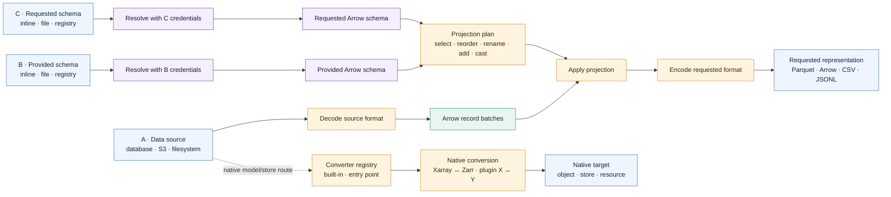

# Interchange design

`fsspec-data` is the interchange boundary between packages that produce tabular data and
packages that consume it. It reconciles formats and schemas without absorbing database,
dataframe, or user-interface responsibilities.

## Data, schemas, projection, and conversion

Three independently located inputs define one interchange request: data source A, provided
schema B, and requested schema C. B describes how to interpret A. C describes the columns and
types the consumer wants. A projection is the logical mapping from B to C; conversion is the
physical decoding and encoding around that mapping.

Schema resolution may perform I/O, but it completes before source data is opened. Each
reference carries only its own storage or registry credentials. Once B and C are Arrow
schemas, planning is pure: it validates the requested projection without reading A. Execution
then decodes, applies that stable plan batch by batch, and encodes the requested representation.

## Why resource converters sit beside Arrow codecs

Arrow batches are the right boundary for tabular, single-object formats. They are not a
lossless universal representation for every data model. An Xarray dataset can contain
N-dimensional variables, named dimensions, coordinates, and attributes, while a Zarr group
is a hierarchy of metadata and chunk objects rather than one seekable file.

Forcing those resources through the file-codec path would either flatten model semantics or
pretend a multi-object store is one file. The converter registry therefore provides a sibling
route. A converter owns the semantics of its source and target types and may return an object,
write a store, or use Arrow internally when that is appropriate. Entry-point discovery lets
integration packages add routes without adding their dependencies or release cadence to
`fsspec-data`.

`DataFileSystem` remains the read-only façade for single-file tabular conversion. Native
resource conversion uses `ConverterRegistry` directly because its output may not satisfy a
file-like `open()` contract.

## Arrow is the internal boundary

Arrow provides one typed, columnar representation for schema comparison, casting, and
batch transport. Codecs translate external encodings into Arrow batches and back again.
Adding a format therefore requires one Arrow decoder and encoder instead of converters for
every pair of formats.

The Rust core and Python bindings share this boundary. Schema decisions, cast
classifications, batch limits, and cancellation semantics remain consistent whether an
integration enters through Rust or PyArrow.

## Planning precedes execution

External schema references are resolved to Arrow schemas before an `InterchangeRequest` is
created. Resolution may read another filesystem or registry and records schema provenance;
it is separate from planning.

JSON Schema resolution translates only structural type information. Arrow schemas do not
encode the complete JSON Schema validation language, so composition, references, ambiguous
unions, and format-dependent conversions are rejected. Validation-only constraints are not
enforced during interchange.

An `InterchangeRequest` separates validation from source-data access. Planning checks that codecs,
field mappings, nullability changes, and casts can satisfy the requested contract without
reading input. Execution then applies that stable plan to each batch.

This split lets an integrating package reject an unsupported request before starting a
database scan or opening an output sink. Runtime checks remain necessary only for facts the
schema cannot prove, such as whether a string contains an integer or a nullable column
actually contains nulls.

## Streaming is the default execution model

Record batches keep memory bounded and allow a consumer to stop early. Row, batch, and byte
limits protect previews and interactive clients from unexpectedly large inputs.
Cancellation propagates through the planned stream to its decoder.

Encoded conversion is a buffering adapter on top of that stream. It exists for consumers
that require a complete byte buffer, while the batch iterator remains the primary boundary
for scans and previews.

## Package responsibilities remain narrow

- Database libraries own connections, discovery, SQL, predicate pushdown, and
  database-to-Arrow mapping.
- Dataframe integrations own expression translation and local fallback execution.
- Browsers own pagination, rendering, and request lifecycles.
- `fsspec-data` owns schema resolution, projections, format conversion, casts, and
  interchange limits.

These boundaries keep backend-specific semantics close to each backend and make the
interchange layer reusable by all of them.

## Current transport boundary

Python codec methods accept encoded input as bytes-like objects or binary file-like readers.
Reader-backed input lets row limits and cancellation stop upstream reads before EOF instead
of requiring the complete encoded source to cross the Python/Rust boundary first.

Parquet readers must be seekable because Parquet metadata is stored in the footer and column
chunks can reside at different offsets. Arrow IPC, CSV, and JSONL consume readers
sequentially, but use the same seekable reader contract so registry consumers have one input
boundary.

`DataFileSystem` opens its inner source through fsspec, applies its schema plan batch by
batch, and writes encoded output directly into a seekable spooled file. This bounds
intermediate transport memory without changing the filesystem contract: `_open()` still
completes conversion before returning the spool, and `info()` may perform a complete
conversion to determine output size. Individual format writers may also buffer internally;
in particular, Parquet can defer encoded output until `finish`.
